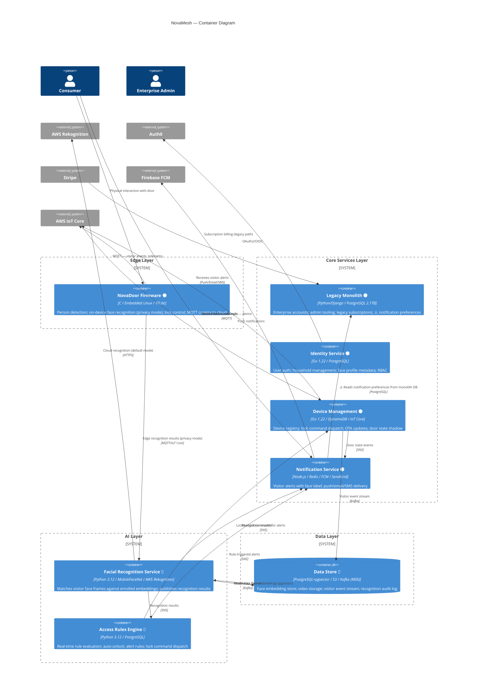

# Container Diagram (C4 Level 2)

This diagram shows the eight core components of the NovaMesh platform.

**Legend**:
- 🟢 LIVE — in production
- 🟡 MIGRATING — being rebuilt or extracted
- 🔵 IN-BUILD — active development, not yet in production

---

## Key Observations

### 1. The Monolith as a Hidden Hub
Despite being "MIGRATING," the Legacy Monolith has a dangerous hidden connection: the Notification Service **reads notification preferences from the monolith database**. This means a monolith failure disrupts visitor alerts — the primary consumer value proposition — even though the two services appear separate.

### 2. AWS Rekognition: No Abstraction Layer
The Facial Recognition Service sends face frames directly to AWS Rekognition with no abstraction layer. Any API change, outage, or pricing change hits the core product feature immediately. All biometric data processed in cloud mode crosses into AWS's systems.

### 3. The Auto-Unlock Chain
The critical path for auto-unlock is: **Facial Recognition → Access Rules Engine → Device Management → NovaDoor**. All four components must be working. They are owned by different teams and affected by different stressors, yet there is no end-to-end SLO for this chain.

### 4. Lock Commands Have No Fallback
If AWS IoT Core is unavailable, lock/unlock commands from the app or access rules cannot reach the device. The NovaDoor in edge mode can still execute locally-stored rules, but remote unlock is unavailable.
