# Container Diagram (C4 Level 2)

This diagram shows all deployable units in the NovaMesh platform, colour-coded by status.

**Legend**:
- 🟢 LIVE — in production
- 🟡 MIGRATING — being rebuilt or extracted
- 🔵 IN-BUILD — active development, not yet in production
- ⚪ PLANNED — on roadmap

```mermaid
C4Container
    title NovaMesh — Container Diagram

    Person(consumer, "Consumer")
    Person(enterprise_admin, "Enterprise Admin")

    System_Boundary(zone1, "Zone 1: Customer-Facing") {
        Container(web_app, "Web Application 🟢", "React / TypeScript / CDN", "Consumer and enterprise dashboards; face enrollment wizard; live camera view; access rules configuration")
        Container(mobile_app, "Mobile Apps 🟢", "React Native (iOS + Android)", "Real-time visitor alerts; live camera; remote unlock; face enrollment; door history")
        Container(novadoor_fw, "NovaDoor Firmware 🟢", "C / Embedded Linux / TFLite", "Person detection; on-device face recognition (privacy mode); lock control; MQTT comms")
    }

    System_Boundary(zone2, "Zone 2: Core Platform Services") {
        Container(api_gw, "API Gateway 🟢", "AWS API Gateway + Lambda", "JWT auth; rate limiting; routing")
        Container(identity, "Identity Service 🟢", "Go 1.22 / PostgreSQL", "User auth; household management; face profile metadata; RBAC")
        Container(monolith, "Legacy Monolith 🟡", "Python/Django / PostgreSQL 2.1TB", "Enterprise accounts; legacy subscriptions; admin tooling; notification preferences")
        Container(subscription, "Subscription & Billing 🟡", "Node.js / PostgreSQL (dual-write)", "Subscription lifecycle; feature entitlement gating; Stripe integration")
        Container(device_mgmt, "Device Management 🟢", "Go 1.22 / DynamoDB / IoT Core", "Device registry; lock command dispatch; OTA updates; door state shadow")
        Container(notification, "Notification Service 🟢", "Node.js / Redis / FCM / SendGrid", "Visitor alerts with face label; push/email/SMS delivery")
        Container(ecommerce, "E-Commerce 🟢", "Shopify Plus + ShipBob", "Hardware sales; order fulfilment; post-purchase webhook")
        Container(support, "Customer Support 🟢", "Zendesk + chatbot", "Ticket management; support chatbot escalation")
    }

    System_Boundary(zone3, "Zone 3: AI & Intelligence") {
        Container(ai_orch, "AI Orchestration 🔵", "Python 3.12 / FastAPI / Redis", "Routes recognition requests; manages AI vendor APIs; rate limiting; caching")
        Container(face_recog, "Facial Recognition Engine 🔵", "Python 3.12 / MobileFaceNet / pgvector", "Embeds visitor faces; matches against enrolled embeddings; recognition result events")
        Container(visitor_intel, "Visitor Intelligence Engine 🔵", "Python 3.12 / YOLOv8", "Package detection; visitor pattern analysis; familiar face suggestions")
        Container(access_rules, "Access Rules Engine 🔵", "Python 3.12 / PostgreSQL", "Real-time rule evaluation; auto-unlock; alert rules; block list; time-based access")
        Container(support_chatbot, "Support Chatbot 🔵", "Python 3.12 / RAG / Pinecone", "LLM support assistant; RAG over knowledge base")
    }

    System_Boundary(zone4, "Zone 4: Foundation") {
        Container(data_platform, "Data Platform 🔵", "S3 + Kafka + Snowflake + pgvector", "Visitor event stream; video storage; face embedding store; recognition audit log; BI")
        Container(observability, "Observability 🟢", "Datadog + PagerDuty", "APM; logs; tracing; alerting")
        ContainerDb(faces_db, "Face Embedding Store 🔵", "PostgreSQL + pgvector", "Enrolled face embeddings; biometric data — strict access controls")
        ContainerDb(video_store, "Video Storage 🟢", "S3 (encrypted, tiered)", "Per-household video clips with tier-appropriate retention")
    }

    System_Ext(rekognition, "AWS Rekognition")
    System_Ext(auth0, "Auth0")
    System_Ext(stripe, "Stripe")
    System_Ext(fcm, "Firebase FCM")
    System_Ext(iot_core, "AWS IoT Core")

    Rel(consumer, mobile_app, "Uses")
    Rel(consumer, web_app, "Uses")
    Rel(enterprise_admin, web_app, "Uses")

    Rel(mobile_app, api_gw, "API calls", "HTTPS")
    Rel(web_app, api_gw, "API calls", "HTTPS")
    Rel(web_app, monolith, "⚠️ Direct legacy calls (bypasses gateway)", "HTTPS")

    Rel(novadoor_fw, iot_core, "MQTT — visitor events, telemetry", "TLS")
    Rel(iot_core, device_mgmt, "Routes device messages")
    Rel(device_mgmt, iot_core, "Lock/unlock commands → device", "MQTT")

    Rel(api_gw, identity, "JWT validation")
    Rel(api_gw, subscription, "Routes")
    Rel(api_gw, device_mgmt, "Routes")
    Rel(api_gw, face_recog, "Routes — face enrollment")
    Rel(api_gw, access_rules, "Routes — rule configuration")

    Rel(device_mgmt, data_platform, "Visitor event stream", "Kafka")
    Rel(device_mgmt, notification, "Door state events", "SNS")

    Rel(data_platform, face_recog, "Visitor face frames", "Kafka")
    Rel(face_recog, faces_db, "Read/write face embeddings")
    Rel(face_recog, rekognition, "Cloud recognition fallback", "HTTPS")
    Rel(face_recog, access_rules, "Recognition results", "SNS")
    Rel(face_recog, notification, "Recognition results for alerts", "SNS")

    Rel(access_rules, device_mgmt, "Lock/unlock commands")
    Rel(access_rules, notification, "Rule-triggered alerts", "SNS")
    Rel(visitor_intel, notification, "Package detection alerts", "SNS")

    Rel(subscription, monolith, "⚠️ Dual-write (migration state)", "PostgreSQL")
    Rel(notification, monolith, "⚠️ Reads preferences from monolith DB", "PostgreSQL")

    Rel(identity, auth0, "OAuth2/OIDC")
    Rel(subscription, stripe, "Payment processing")
    Rel(notification, fcm, "Push notifications")
    Rel(data_platform, video_store, "Video clips")

    Rel(novadoor_fw, face_recog, "Edge recognition results (privacy mode)", "MQTT/IoT Core")
```

---

## Key Observations for Workshop Participants

### 1. The Monolith as a Hidden Hub
Despite being marked as "MIGRATING," the Legacy Monolith (C2) has two dangerous hidden connections:
- The Notification Service **reads notification preferences from the monolith database** — this is not shown in the main component diagram
- The Subscription Service **dual-writes to the monolith DB** — creating bidirectional coupling

These connections mean the monolith's failure mode propagates into components that appear separate.

### 2. AWS Rekognition as an Architectural Island
The Facial Recognition Engine depends on AWS Rekognition (external API) with **no abstraction layer**. This is a concentration risk even more significant than the former OpenAI dependency, because:
- Face recognition is the **core product differentiator**, not a supporting feature
- Biometric data (face frames) are sent to an external service, creating regulatory exposure
- Any Rekognition API change, price change, or outage directly disables the primary product capability

### 3. The Door Lock Safety Dimension
Unlike a typical web platform, NovaMesh has physical safety implications. The Device Management Service dispatches lock/unlock commands via AWS IoT Core with **no local fallback**. If the cloud path is unavailable, the NovaDoor firmware must decide independently whether to fail-secure (stay locked) or fail-safe (unlock). This behaviour is not yet user-configurable.

### 4. Biometric Data Cross-Cutting Concern
Face embeddings (stored in `novamesh-faces-db`) and video clips (in S3) are subject to GDPR and BIPA. However, these stores are touched by: Identity Service (C1), Facial Recognition Engine (C9), Data Platform (C13), Access Rules Engine (C11), and potentially the Legacy Monolith (C2) via admin tooling. There is no single service that owns the full deletion and consent lifecycle.

### 5. Notification Service Alert Timing
The consumer value proposition ("know who's at your door in real-time") depends on a chain: NovaDoor detects person → Kafka event → Facial Recognition → SNS event → Notification Service → Firebase FCM → Mobile. Any delay or failure in this chain degrades the core experience. The current p95 push notification delivery target is 10s — but the full chain from person detection to mobile alert has no end-to-end SLO.
