# Container Diagram (C4 Level 2)

This diagram shows the major containers (deployable units) within the NovaMesh Platform. Colour coding reflects the component status.

> **Status colours**: Green = LIVE | Yellow = MIGRATING | Orange = IN-BUILD | Grey = PLANNED

```mermaid
C4Container
    title Container Diagram — NovaMesh Platform (As-Is)

    Person(consumer, "Consumer", "Web / Mobile")
    Person(enterprise_admin, "Enterprise Admin", "Web Portal")

    System_Boundary(zone1, "Zone 1 — Customer-Facing Layer") {
        Container(web_app, "Web Application", "React / TypeScript", "Consumer dashboard, enterprise portal, device management UI")
        Container(mobile_app, "Mobile Apps", "React Native", "iOS and Android home control and monitoring apps")
        Container(hub_firmware, "Hub Firmware", "C / Embedded Linux / TFLite", "Edge device: local AI inference, MQTT communication, OTA update client")
    }

    System_Boundary(zone2, "Zone 2 — Core Platform Services") {
        Container(api_gw, "API Gateway", "AWS API Gateway + Lambda Auth", "Unified API ingress, JWT validation, rate limiting")
        Container(identity_svc, "Identity Service", "Go / PostgreSQL", "User auth, profiles, RBAC — LIVE")
        Container(monolith, "Legacy Monolith", "Python / Django / PostgreSQL", "Enterprise accounts, admin tooling, legacy endpoints — MIGRATING")
        Container(device_svc, "Device Management Service", "Go / DynamoDB / AWS IoT Core", "Device registry, OTA updates, fleet management — LIVE")
        Container(subscription_svc, "Subscription & Billing Service", "Node.js / PostgreSQL", "Plans, payments, entitlements — MIGRATING (dual-write)")
        Container(notification_svc, "Notification Service", "Node.js / Redis", "Push, email, SMS dispatch — LIVE")
        Container(shopify_ext, "E-Commerce (Shopify)", "Shopify Plus", "Hardware sales, orders, post-purchase webhooks — EXTERNAL")
    }

    System_Boundary(zone3, "Zone 3 — AI & Intelligence Layer") {
        Container(ai_orch, "AI Orchestration Service", "Python / FastAPI / Redis", "Unified AI API, provider routing, rate limiting — IN-BUILD 40%")
        Container(anomaly_engine, "Anomaly Detection Engine", "Python / Kafka Consumer", "Network and hardware anomaly detection — IN-BUILD (beta)")
        Container(maintenance_engine, "Predictive Maintenance Engine", "Python / XGBoost", "Hardware failure prediction — IN-BUILD (PoC)")
        Container(ai_assistant, "AI Assistant", "Python / OpenAI GPT-4o", "Natural language home control — IN-BUILD")
        Container(support_chatbot, "Support Chatbot", "Python / RAG / Pinecone", "Customer support chat, Zendesk escalation — IN-BUILD")
        Container(energy_engine, "Energy Optimisation Engine", "Python", "Home energy recommendations — PLANNED")
        Container(personalisation, "Personalisation Engine", "Python", "Product recommendations, content — PLANNED")
    }

    System_Boundary(zone4, "Zone 4 — Foundation") {
        Container(kafka, "Event Bus (Kafka / MSK)", "Apache Kafka", "Real-time telemetry and business events")
        Container(data_lake, "Data Lake", "S3 + AWS Glue + Athena", "Raw and processed data storage")
        Container(data_warehouse, "Data Warehouse", "Snowflake", "Analytics and BI — IN-BUILD")
        Container(observability, "Observability Stack", "Datadog + PagerDuty", "Metrics, logs, traces, alerting")
    }

    System_Ext(auth0_ext, "Auth0", "IdP")
    System_Ext(stripe_ext, "Stripe", "Payments")
    System_Ext(openai_ext, "OpenAI API", "LLM / Embeddings")
    System_Ext(anthropic_ext, "Anthropic API", "LLM Fallback")
    System_Ext(firebase_ext, "Firebase FCM", "Push")
    System_Ext(zendesk_ext, "Zendesk", "Support")
    System_Ext(aws_iot, "AWS IoT Core", "MQTT Broker")
    System_Ext(hubspot_ext, "HubSpot", "CRM")

    Rel(consumer, web_app, "Uses", "HTTPS")
    Rel(consumer, mobile_app, "Uses", "HTTPS / BT (provisioning)")
    Rel(enterprise_admin, web_app, "Manages fleet", "HTTPS")
    Rel(hub_firmware, aws_iot, "Sends telemetry", "MQTT/TLS")
    Rel(aws_iot, device_svc, "Routes messages", "AWS IoT Rule")

    Rel(web_app, api_gw, "API calls", "HTTPS / REST")
    Rel(mobile_app, api_gw, "API calls", "HTTPS / REST")
    Rel(web_app, monolith, "Legacy direct calls", "HTTPS (bypass)", $tags="warning")

    Rel(api_gw, identity_svc, "Validates JWT / routes", "HTTP")
    Rel(api_gw, device_svc, "Routes device requests", "HTTP")
    Rel(api_gw, subscription_svc, "Routes billing requests", "HTTP")
    Rel(api_gw, ai_orch, "Routes AI requests", "HTTP")
    Rel(api_gw, monolith, "Routes legacy requests", "HTTP")

    Rel(identity_svc, auth0_ext, "Auth delegation", "OAuth2/OIDC")
    Rel(subscription_svc, stripe_ext, "Payment processing", "Stripe API")
    Rel(shopify_ext, api_gw, "Post-purchase webhook", "HTTPS")

    Rel(ai_orch, openai_ext, "LLM requests", "REST API")
    Rel(ai_orch, anthropic_ext, "Fallback LLM", "REST API")
    Rel(ai_assistant, ai_orch, "AI requests", "HTTP")
    Rel(support_chatbot, ai_orch, "AI requests", "HTTP")
    Rel(anomaly_engine, kafka, "Consumes telemetry", "Kafka Consumer")
    Rel(hub_firmware, kafka, "Publishes telemetry", "via IoT Core → Kafka")
    Rel(kafka, data_lake, "Streams to lake", "Kafka Connect / S3 Sink")
    Rel(data_lake, data_warehouse, "ELT", "AWS Glue / Airbyte")

    Rel(notification_svc, firebase_ext, "Push delivery", "FCM API")
    Rel(support_chatbot, zendesk_ext, "Ticket creation / KB query", "Zendesk API")
    Rel(monolith, hubspot_ext, "CRM sync (partial)", "HubSpot API")

    UpdateLayoutConfig($c4ShapeInRow="4", $c4BoundaryInRow="2")
```

---

## Key Observations for Workshop Participants

### 1. The Monolith as a Hidden Hub
Despite being "migrating," the Legacy Monolith still has **direct connections from the Web App** that bypass the API Gateway. This means it is not truly isolated and any monolith failure creates cascading issues beyond what the dependency graph suggests.

### 2. AI Layer is an Architectural Island
The AI & Intelligence Layer (Zone 3) is being built somewhat independently. The **AI Orchestration Service** is designed to be the single entry point, but it is only 40% complete, and several AI components (AI Assistant, Support Chatbot) have direct connections to external AI APIs without proper fallback paths.

### 3. Data Flows Are Partially Unidirectional
Telemetry flows from Hub → AWS IoT Core → Kafka → Data Lake cleanly. But training data flowing back from the Data Lake to ML models has no automated pipeline in most cases. This means AI models can become stale.

### 4. Notification Service Dependency on Monolith
The **Notification Service** reads preference data from the monolith database. This creates an undocumented coupling: the Notification Service cannot function correctly if the monolith database is unavailable, even though it appears to be an independent microservice.

### 5. No Internal Service Mesh
Service-to-service calls within Zone 2 are plain HTTP without mTLS, circuit breakers, or retries enforced at the infrastructure level. Resilience patterns are implemented inconsistently across services.
