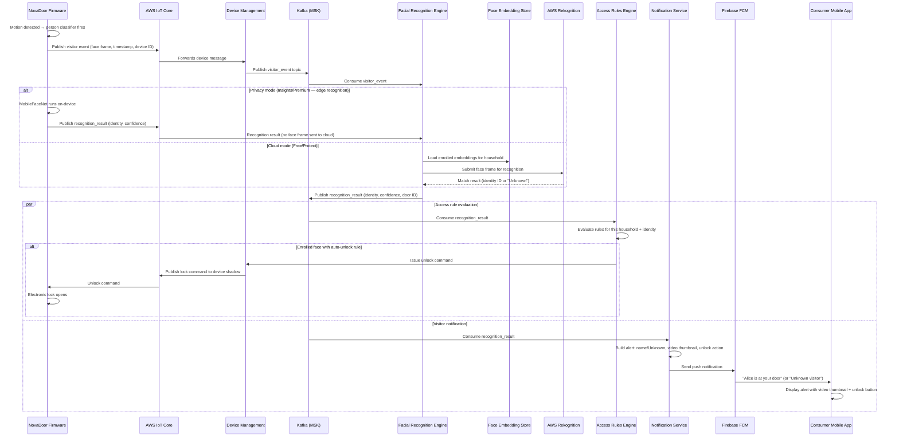
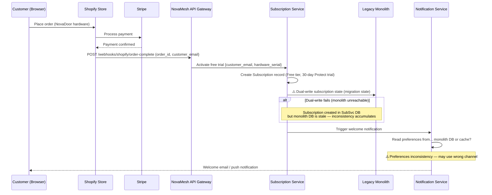
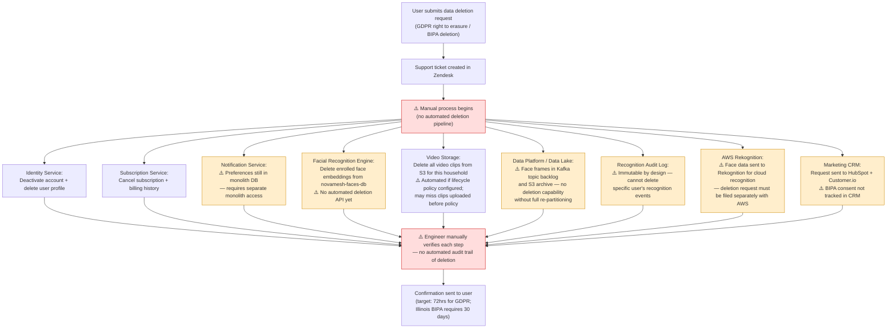

# Data Flow Diagrams

Six key data flows across the NovaMesh platform, covering the most architecturally significant paths.

---

## Flow 1: Visitor Detection → Face Recognition → Alert

The primary product flow: a visitor arrives, the NovaDoor detects them, recognition runs, and the homeowner is notified.



---

## Flow 2: Face Enrollment

How a household member adds a new recognised face to the system.

```mermaid
sequenceDiagram
    participant User as Consumer (Mobile App)
    participant API as API Gateway
    participant Identity as Identity Service
    participant FaceRecog as Facial Recognition Engine
    participant FacesDB as Face Embedding Store
    participant Subscription as Subscription Service

    User->>API: POST /faces/enroll {name, photos: [frame1, frame2, frame3]}
    API->>API: Validate JWT token
    API->>Subscription: Check entitlement: can this household enroll another face?
    Subscription-->>API: Entitlement result (e.g., Free tier: blocked; Protect: check count ≤ 10)

    alt Over enrollment limit for tier
        API-->>User: 403 Enrollment limit reached — upgrade to Insights
    else Within limit
        API->>FaceRecog: Enroll face {household_id, name, frames}
        FaceRecog->>FaceRecog: Extract embeddings from frames
        FaceRecog->>FaceRecog: Quality check (blur, occlusion, lighting)
        FaceRecog->>FacesDB: Store face embeddings + name + household_id
        FaceRecog->>Identity: Update face profile metadata (face_id, name)
        FaceRecog-->>API: Enrollment result {face_id, quality_score}
        API-->>User: 200 Face enrolled — Alice added to your household
    end
```

---

## Flow 3: Hardware Purchase → Subscription Activation

How buying a NovaDoor hardware unit activates a subscription trial.



---

## Flow 4: Remote Door Unlock

How a homeowner unlocks their door remotely from the mobile app.

```mermaid
sequenceDiagram
    participant User as Consumer (Mobile)
    participant API as API Gateway
    participant Identity as Identity Service
    participant Subscription as Subscription Service
    participant DevMgmt as Device Management
    participant IoT as AWS IoT Core
    participant Door as NovaDoor Firmware

    User->>API: POST /doors/{door_id}/unlock
    API->>Identity: Validate JWT; check RBAC (is user authorised for this door?)
    Identity-->>API: Authorised
    API->>Subscription: Check entitlement (remote unlock available on Protect+ only)
    Subscription-->>API: Entitlement granted

    API->>DevMgmt: Issue unlock command {door_id, user_id, timestamp}
    DevMgmt->>IoT: Publish to device shadow: desired lock_state = unlocked
    IoT->>Door: Deliver lock command via MQTT

    alt Device online
        Door->>Door: Actuate electronic lock — door unlocks
        Door->>IoT: Report lock_state = unlocked (acknowledged)
        IoT->>DevMgmt: State sync — confirmed unlock
        DevMgmt-->>API: Unlock confirmed
        API-->>User: Door unlocked ✓
    else Device offline (cloud unreachable from device side)
        Note over IoT,Door: Command queued in device shadow<br/>Lock actuates when device reconnects
        API-->>User: Command sent — will execute when device reconnects
    end
```

---

## Flow 5: OTA Firmware Update

How a firmware update reaches NovaDoor devices in the field. Note the safety implications given the door lock component.

```mermaid
sequenceDiagram
    participant Engineer as NovaMesh Engineer
    participant S3 as S3 (Firmware Artefacts)
    participant DevMgmt as Device Management
    participant IoT as AWS IoT Core
    participant Door as NovaDoor Firmware

    Engineer->>S3: Upload firmware v2.x.x (signed binary)
    Engineer->>DevMgmt: POST /ota/campaigns {version, target_devices, rollout_pct: 5%}
    Note over DevMgmt: Canary rollout: 5% of fleet first

    DevMgmt->>IoT: Publish OTA job to target devices
    IoT->>Door: Notify: new firmware available {download_url, checksum}
    Door->>S3: Download firmware (HTTPS, signed URL)
    Door->>Door: Verify signature + checksum
    Door->>Door: Apply firmware update
    Door->>Door: Reboot...

    alt Update succeeds
        Door->>IoT: Report firmware_version = v2.x.x (online)
        IoT->>DevMgmt: State sync — update confirmed
        DevMgmt->>DevMgmt: Increment success counter; check threshold before expanding rollout
    else Update fails (3–5% of devices)
        Door->>Door: ⚠️ Boot loop or failed verification
        Note over Door: Door lock may be in unknown state
        Door->>IoT: Offline (no heartbeat)
        Note over DevMgmt: ⚠️ No automated rollback<br/>Manual SSH intervention required<br/>Lock state unknown until recovered
        DevMgmt->>DevMgmt: Alert on-call engineer
    end
```

---

## Flow 6: Biometric Data Deletion Request (GDPR / BIPA)

The current (fragmented) process for handling a user's request to delete their biometric and personal data — illustrating the data governance gap.



**Key observation**: The biometric deletion problem is significantly more complex than standard PII deletion. Face embeddings may exist in: the face embedding store (C8 — `novamesh-faces-db`), the Kafka topic backlog (C8), S3 archives (C8), AWS Rekognition's own storage (external), and the recognition audit log (C8). There is currently no single service that can answer: "has all biometric data for this user been deleted?"
