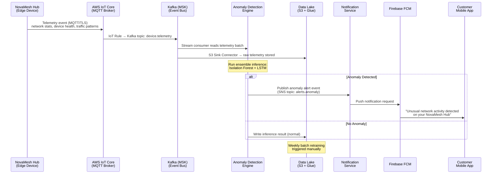
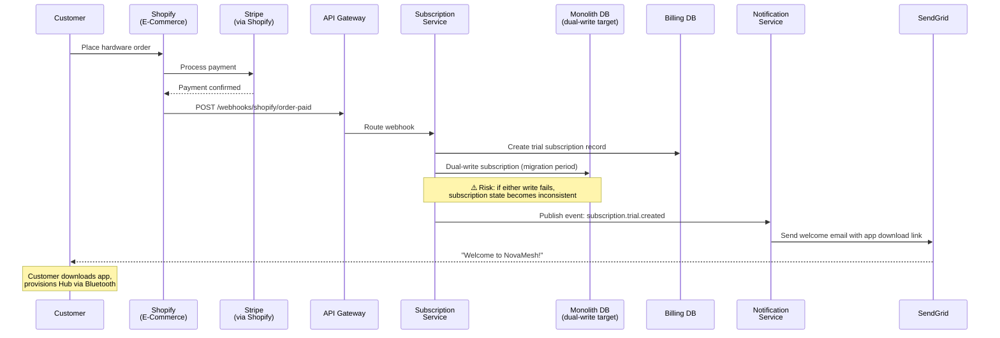
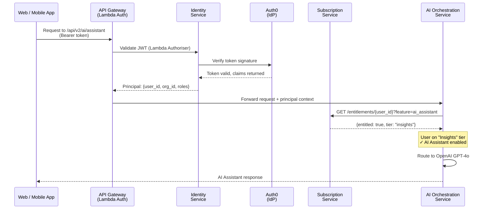
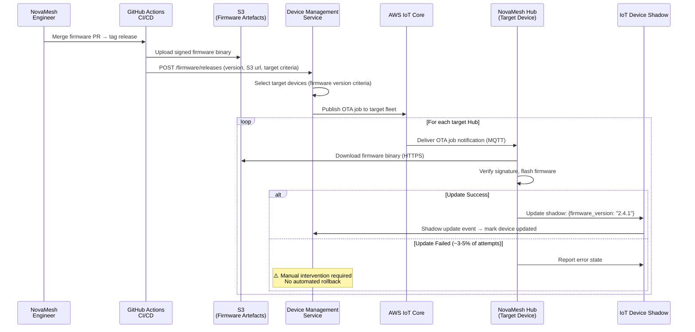
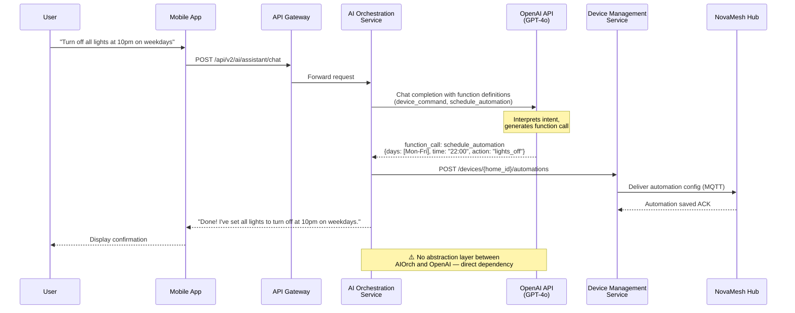
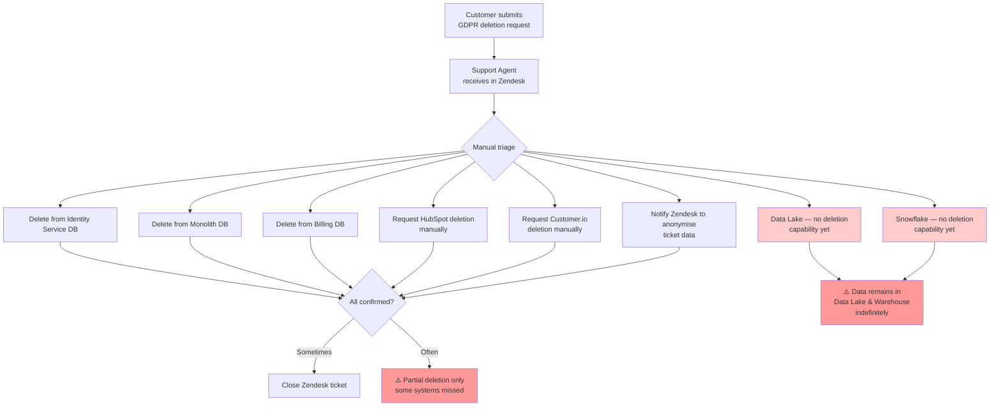

# Data Flow Diagrams

This document shows how data moves through the NovaMesh platform for key scenarios.

---

## Flow 1: Device Telemetry → AI Anomaly Detection → Alert

This is the primary real-time data flow driving NovaMesh's AI security feature.

---

## Flow 2: Hardware Purchase → Subscription Activation

The post-purchase flow that onboards new hardware customers into the subscription platform.

---

## Flow 3: User Authentication & Feature Entitlement Check

---

## Flow 4: OTA Firmware Update

---

## Flow 5: AI Assistant — Natural Language Home Control

---

## Flow 6: GDPR Data Deletion Request (Current State — Manual & Fragmented)

This flow illustrates a current **architectural gap** that is particularly relevant for stressor analysis.

> This flow is a significant regulatory risk. A single automation service and event-driven deletion pipeline is on the roadmap but not yet designed.
