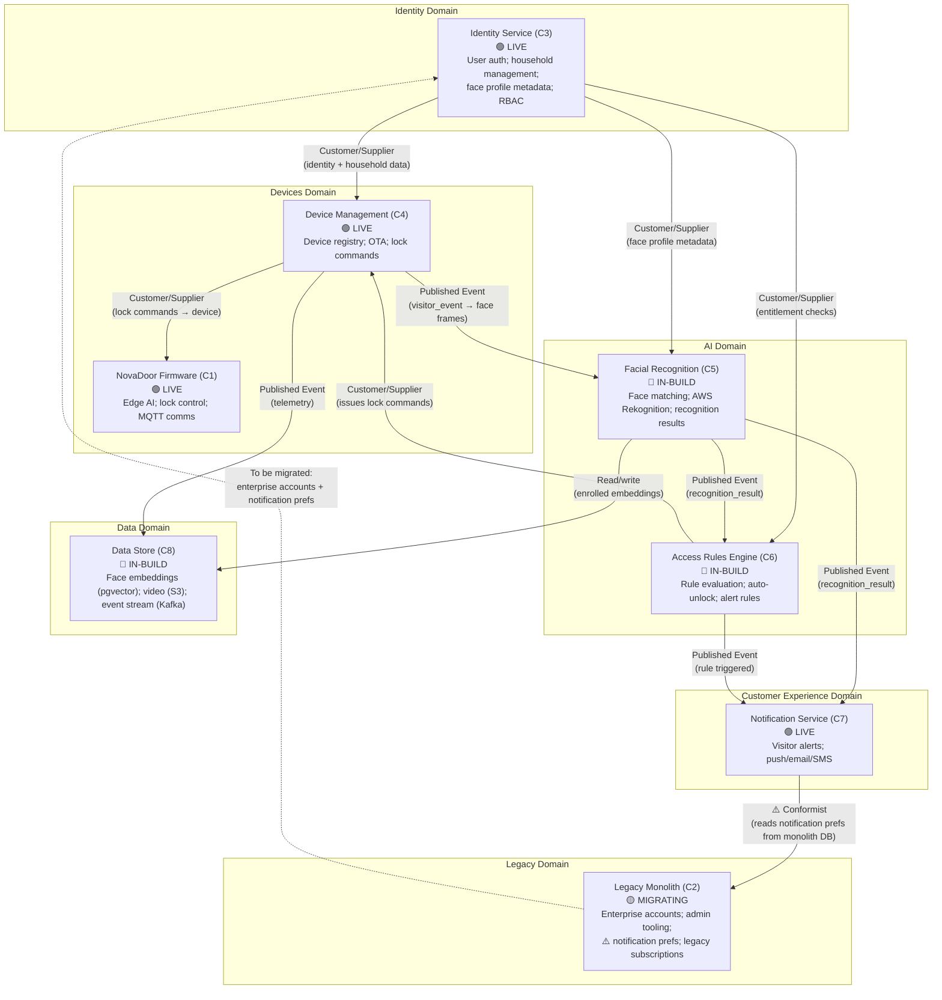

# Domain Map — Bounded Context Map

This diagram shows the NovaMesh bounded contexts (domains) and their relationships.

---

## The Hidden Coupling: Notification Service ↔ Monolith

The `⚠️ Conformist` relationship between the Notification Service and the Legacy Monolith is the most important hidden coupling in this map. The Notification Service reads notification preferences from the monolith database — a dependency that does not appear in any component diagram, but means that a monolith failure disrupts visitor alerts for all customers.

---

## The Biometric Data Domain Problem

Biometric data (face embeddings) has cross-cutting ownership across multiple domains:
- **Identity Service (C3)** owns face profile metadata (which person, which household)
- **Facial Recognition Service (C5)** owns the embeddings themselves and the enrollment process
- **Data Store (C8)** stores face frames, recognition audit logs, and embeddings
- **Access Rules Engine (C6)** uses recognition results to trigger physical door events

There is no single bounded context that owns the full lifecycle of biometric data — from enrollment through consent tracking, use, and deletion. This creates hyperliminal coupling through the **regulatory specification** (GDPR / BIPA): any enforcement action for biometric data touches all four domains simultaneously.

---

## Domain Ownership Summary

| Domain | Component | Status | Priority |
|---|---|---|---|
| Identity | C3 — Identity Service | LIVE | Migration mostly done |
| Devices — Fleet | C4 — Device Management | LIVE | Mostly done |
| Devices — Edge | C1 — NovaDoor Firmware | LIVE | High (model update path) |
| AI — Recognition | C5 — Facial Recognition Service | IN-BUILD | **Critical** |
| AI — Rules | C6 — Access Rules Engine | IN-BUILD | High |
| Customer Experience | C7 — Notification Service | LIVE | Medium (prefs migration) |
| Data | C8 — Data Store | IN-BUILD | **Critical** (biometric governance) |
| Legacy | C2 — Legacy Monolith | MIGRATING | **Eliminate** |
