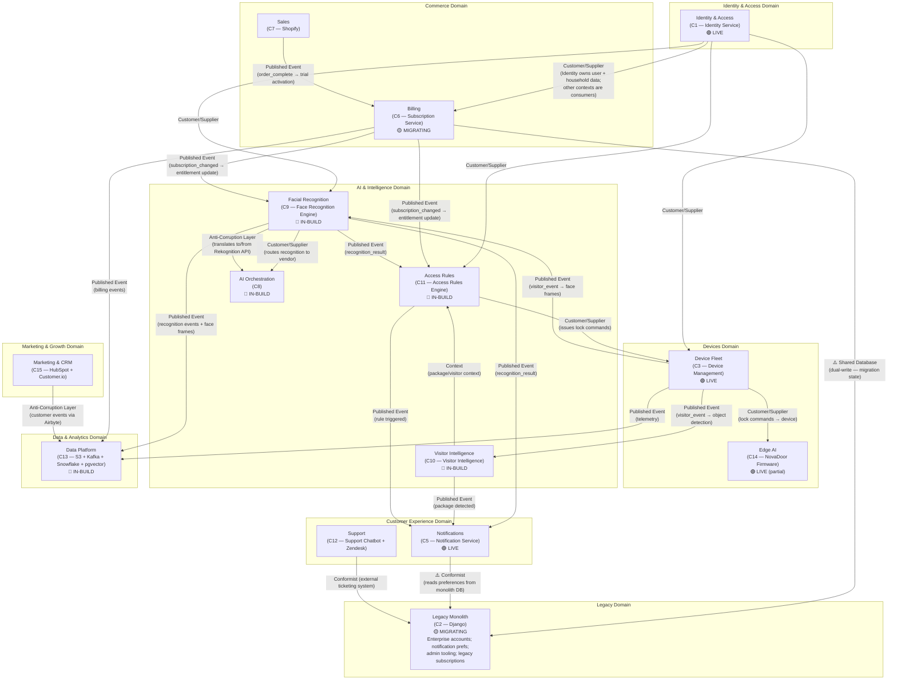

# Domain Map — Bounded Context Map

This diagram shows the NovaMesh bounded contexts (domains) and their relationships, using Domain-Driven Design (DDD) terminology.

---

## Domain Ownership Matrix

| Domain | Owning Team | Maturity | Migration Priority |
|---|---|---|---|
| Identity & Access | Platform Engineering | High | Mostly done (~60%) |
| Commerce — Sales | Marketing/Ops | Medium (external) | Low |
| Commerce — Billing | Platform Engineering | Medium (migrating) | High |
| Devices — Fleet | Platform Engineering | High | Mostly done |
| Devices — Edge AI | Firmware + AI/ML | Medium (partial) | High (model update path) |
| AI — Facial Recognition | AI/ML Team | Low (beta) | **Critical** |
| AI — Visitor Intelligence | AI/ML Team | Very Low (PoC) | Medium |
| AI — Access Rules | AI/ML + Platform | Low (beta) | High |
| AI — Orchestration | AI/ML Team | Very Low (40%) | High |
| Customer Experience — Notifications | Platform Engineering | High | Medium (prefs migration) |
| Customer Experience — Support | AI/ML Team | Low (in-build) | Medium |
| Marketing & Growth | Marketing | Medium (external) | Low |
| Data & Analytics | Platform + AI/ML | Low (in-build) | **Critical** (biometric data) |
| Legacy | Platform Engineering | — (diminishing) | **Eliminate** |

---

## The Enterprise Domain Gap

The Enterprise domain — which covers multi-door management, multi-site access control, visitor clearance workflows, and compliance reporting — sits **entirely inside the Legacy Monolith**. There is no extracted bounded context for it. This means:

1. Enterprise features cannot be independently deployed, scaled, or tested
2. All enterprise account data is mixed with consumer data in the `novamesh-monolith-db` database (no tenant isolation at the DB level)
3. Any monolith failure affects enterprise customers disproportionately — their administration capabilities depend entirely on the monolith admin portal

Extracting the Enterprise domain is listed as a migration priority but has not yet started.

---

## The Biometric Data Domain Problem

Unlike standard user PII, biometric data (face embeddings) has cross-cutting ownership:
- **Identity Service** (C1) owns face profile metadata (which person, which household)
- **Facial Recognition Engine** (C9) owns the embeddings themselves and the enrollment process
- **Data Platform** (C13) stores face frames, recognition audit logs, and training data
- **Access Rules Engine** (C11) uses recognition results to trigger physical door events

There is no single bounded context that owns the full lifecycle of biometric data — from enrollment through consent tracking, use, and deletion. This creates a classic hyperliminal coupling through the **regulatory specification** (GDPR / BIPA): any enforcement action for biometric data touches all four domains simultaneously.
