# Domain Map — Bounded Contexts

This diagram shows the domain-oriented decomposition of the NovaMesh platform, illustrating how business capabilities map to bounded contexts and the relationships (context mappings) between them.

---

## Bounded Context Map

```mermaid
graph TB
    subgraph Identity["🔑 Identity & Access Domain"]
        direction TB
        IAM_CTX["Identity Context\n─────────────\nUser registration & auth\nSession management\nMFA / OAuth2\nRBAC roles\n\n[C1 — Identity Service]"]
    end

    subgraph Commerce["🛒 Commerce Domain"]
        direction TB
        SALES_CTX["Sales Context\n─────────────\nHardware product catalogue\nOrder management\nFulfilment coordination\nPost-purchase activation\n\n[C7 — Shopify EXTERNAL]"]
        BILLING_CTX["Billing & Subscription Context\n─────────────\nSubscription lifecycle\nPayment processing\nPlan entitlements\nInvoicing & refunds\n\n[C6 — Subscription Service]"]
    end

    subgraph Devices["📡 Device Domain"]
        direction TB
        FLEET_CTX["Device Fleet Context\n─────────────\nDevice registry & provisioning\nFirmware version management\nOTA update campaigns\nFleet health monitoring\n\n[C3 — Device Management Service]"]
        EDGE_CTX["Edge Intelligence Context\n─────────────\nOn-device inference\nLocal automation rules\nPrivacy-preserving processing\nWake-word detection\n\n[C14 — Hub Firmware]"]
    end

    subgraph Intelligence["🤖 AI & Intelligence Domain"]
        direction TB
        AI_ORCH_CTX["AI Orchestration Context\n─────────────\nAI provider routing\nRate limiting & cost control\nFallback management\nUsage tracking\n\n[C8 — AI Orchestration Service]"]
        ANOMALY_CTX["Anomaly Detection Context\n─────────────\nNetwork threat detection\nDevice health anomalies\nAlert generation\nModel retraining\n\n[C9 — Anomaly Engine]"]
        MAINTENANCE_CTX["Predictive Maintenance Context\n─────────────\nFailure prediction\nProactive replacement triggers\n\n[C10 — Maintenance Engine]"]
        ASSISTANT_CTX["AI Assistant Context\n─────────────\nNatural language control\nHome automation via NLU\nContextual recommendations\n\n[C11 — AI Assistant]"]
    end

    subgraph CX["💬 Customer Experience Domain"]
        direction TB
        SUPPORT_CTX["Support Context\n─────────────\nTicket management\nKnowledge base\nAI-assisted resolution\nEscalation workflows\n\n[C12 — Support Chatbot + Zendesk]"]
        NOTIFY_CTX["Notification Context\n─────────────\nMulti-channel delivery\nPreference management\nAlert routing\n\n[C5 — Notification Service]"]
    end

    subgraph Marketing["📣 Marketing & Growth Domain"]
        direction TB
        CRM_CTX["CRM & Marketing Context\n─────────────\nLead management\nLifecycle automation\nCampaign execution\nAI personalisation (PLANNED)\n\n[C15 — HubSpot + Customer.io]"]
    end

    subgraph Data["📊 Data & Analytics Domain"]
        direction TB
        DATA_CTX["Data Platform Context\n─────────────\nReal-time event streaming\nData lake & warehouse\nML training data\nBusiness analytics\n\n[C13 — Data Platform]"]
    end

    subgraph Legacy["⚠️ Legacy (Transitional)"]
        direction TB
        MONOLITH_CTX["Monolith Context\n─────────────\nEnterprise account mgmt\nAdmin tooling\nLegacy subscription endpoints\nSupport back-office\n\n[C2 — Django Monolith]"]
    end

    %% Context relationships
    IAM_CTX -->|"Shared Kernel\nUser identity"| BILLING_CTX
    IAM_CTX -->|"Upstream / Downstream\nAuth principal"| FLEET_CTX
    IAM_CTX -->|"Upstream / Downstream\nAuth principal"| AI_ORCH_CTX

    SALES_CTX -->|"Published Event\norder.purchased"| BILLING_CTX
    BILLING_CTX -->|"Conformist\nEntitlement check"| AI_ORCH_CTX
    BILLING_CTX -->|"Conformist\nEntitlement check"| ANOMALY_CTX

    FLEET_CTX -->|"Published Event\ndevice.telemetry"| DATA_CTX
    FLEET_CTX -->|"Customer/Supplier\nDevice commands"| EDGE_CTX
    EDGE_CTX -->|"Published Event\nedge.inference.result"| DATA_CTX

    DATA_CTX -->|"Training data\nmodel artefacts"| ANOMALY_CTX
    DATA_CTX -->|"Training data"| MAINTENANCE_CTX

    AI_ORCH_CTX -->|"Anti-Corruption Layer\n(partial, in-build)"| ASSISTANT_CTX
    AI_ORCH_CTX -->|"Anti-Corruption Layer\n(partial, in-build)"| ANOMALY_CTX

    ANOMALY_CTX -->|"Published Event\nalert.anomaly"| NOTIFY_CTX
    MAINTENANCE_CTX -->|"Published Event\nalert.maintenance"| NOTIFY_CTX
    ASSISTANT_CTX -->|"Commands"| FLEET_CTX

    SUPPORT_CTX -->|"Customer/Supplier\nTickets & KB"| NOTIFY_CTX
    CRM_CTX -->|"Conformist\nCustomer events"| DATA_CTX

    MONOLITH_CTX -.->|"Shared Database\n⚠️ tight coupling"| BILLING_CTX
    MONOLITH_CTX -.->|"Legacy calls\n⚠️ direct HTTP"| IAM_CTX
    MONOLITH_CTX -.->|"Legacy calls\n⚠️ direct HTTP"| NOTIFY_CTX

    %% Styling
    style Legacy fill:#ffe8cc,stroke:#ff8800
    style Intelligence fill:#e8f4fd,stroke:#2196F3
    style Devices fill:#e8fde8,stroke:#4CAF50
    style Identity fill:#fde8fd,stroke:#9C27B0
    style Commerce fill:#fdfde8,stroke:#FF9800
```

---

## Context Mapping Legend

| Relationship Type | Description |
|---|---|
| **Shared Kernel** | Two contexts share a subset of the domain model; changes must be coordinated |
| **Customer/Supplier** | Upstream (supplier) context provides a service to downstream (customer) |
| **Conformist** | Downstream adopts the upstream model with no translation |
| **Anti-Corruption Layer** | Downstream translates upstream model to protect its own domain model |
| **Published Event** | Upstream emits events; downstream subscribes with no direct coupling |
| **Shared Database** (⚠️) | Two contexts read/write the same physical database — high coupling, technical debt |

---

## Domain Ownership Matrix

| Domain | Team | Maturity | Migration Priority |
|---|---|---|---|
| Identity & Access | Platform Engineering | High | Complete |
| Commerce — Sales | Marketing/Ops (Shopify) | External | N/A |
| Commerce — Billing | Platform Engineering | Medium | High (dual-write risk) |
| Device Fleet | Platform Engineering | High | Complete |
| Edge Intelligence | Firmware + AI/ML | Medium | Low (stable) |
| AI Orchestration | AI/ML Team | Low | Critical (in-build) |
| Anomaly Detection | AI/ML Team | Low | High |
| Predictive Maintenance | AI/ML Team | Very Low | Medium |
| AI Assistant | AI/ML + Frontend | Low | High |
| Support | AI/ML Team | Low | Medium |
| Notifications | Platform Engineering | Medium | Low |
| Marketing & CRM | Marketing | External | N/A |
| Data Platform | Platform + AI/ML | Medium | High |
| Legacy Monolith | Platform Engineering | High (debt) | Critical (decompose) |

---

## Enterprise Domain — Gap

The **Enterprise/B2B domain** is currently entirely inside the Legacy Monolith and has no extracted bounded context. This is a significant gap:

- Multi-tenancy logic is not isolated
- Enterprise billing (custom contracts, volume discounts) is not in the Subscription Service
- Enterprise fleet management capabilities are duplicated between the Monolith and Device Management Service

A dedicated **Enterprise Context** is required before NovaMesh can safely scale its B2B business.
