# System Context Diagram (C4 Level 1)

This diagram shows NovaMesh as a whole system and its relationships with external actors and external systems.

```mermaid
C4Context
    title System Context — NovaMesh Platform

    Person(consumer, "Consumer Customer", "Household using NovaMesh Hub and subscription services")
    Person(enterprise_admin, "Enterprise Admin", "Property manager or IT admin for an enterprise account")
    Person(support_agent, "Support Agent", "NovaMesh customer support staff")
    Person(novamesh_engineer, "NovaMesh Engineer", "Internal developer / SRE / data analyst")

    System(novamesh, "NovaMesh Platform", "Smart home AI platform: device management, subscriptions, AI features, analytics")

    System_Ext(hub_device, "NovaMesh Hub (Physical)", "Edge device installed in customer's home; runs local AI models")

    System_Ext(auth0, "Auth0", "Identity Provider — OAuth2/OIDC")
    System_Ext(stripe, "Stripe", "Payment processing — subscriptions and one-off payments")
    System_Ext(shopify, "Shopify Plus", "Hardware e-commerce storefront")
    System_Ext(shipbob, "ShipBob", "3PL fulfilment for hardware orders")
    System_Ext(openai, "OpenAI API", "GPT-4o for AI Assistant and embeddings for Support Chatbot")
    System_Ext(anthropic, "Anthropic API", "Claude as fallback LLM for AI Assistant")
    System_Ext(firebase, "Firebase FCM", "Mobile push notification delivery")
    System_Ext(sendgrid, "SendGrid", "Transactional email delivery")
    System_Ext(twilio, "Twilio", "SMS notification delivery")
    System_Ext(hubspot, "HubSpot", "CRM — customer and lead management")
    System_Ext(customerio, "Customer.io", "Lifecycle email automation")
    System_Ext(zendesk, "Zendesk", "Customer support ticketing and knowledge base")
    System_Ext(alexa, "Amazon Alexa", "Voice assistant integration")
    System_Ext(google_home, "Google Home", "Smart home integration")
    System_Ext(homekit, "Apple HomeKit", "Smart home integration")

    Rel(consumer, novamesh, "Uses", "Web app, Mobile app, AI Assistant")
    Rel(enterprise_admin, novamesh, "Manages fleet", "Web portal, API")
    Rel(support_agent, novamesh, "Handles support", "Admin portal, Zendesk")
    Rel(novamesh_engineer, novamesh, "Operates and develops", "Internal tools, CI/CD, observability")

    Rel(hub_device, novamesh, "Sends telemetry, receives commands", "MQTT / TLS")
    Rel(novamesh, hub_device, "Delivers OTA updates, sends commands", "MQTT / OTA")

    Rel(novamesh, auth0, "Authenticates users", "OAuth2 / OIDC")
    Rel(novamesh, stripe, "Processes payments", "Stripe API")
    Rel(novamesh, shopify, "Receives purchase events", "Shopify Webhooks")
    Rel(shopify, shipbob, "Triggers fulfilment", "Shopify → ShipBob")
    Rel(novamesh, openai, "AI feature requests", "REST API")
    Rel(novamesh, anthropic, "AI fallback requests", "REST API")
    Rel(novamesh, firebase, "Sends push notifications", "FCM API")
    Rel(novamesh, sendgrid, "Sends transactional emails", "SendGrid API")
    Rel(novamesh, twilio, "Sends SMS alerts", "Twilio API")
    Rel(novamesh, hubspot, "Syncs customer data", "HubSpot API / Airbyte")
    Rel(novamesh, customerio, "Triggers lifecycle emails", "Customer.io API")
    Rel(novamesh, zendesk, "Creates support tickets", "Zendesk API")
    Rel(novamesh, alexa, "Processes voice commands", "Alexa Skill API")
    Rel(novamesh, google_home, "Processes home commands", "Google Home API")
    Rel(novamesh, homekit, "Integrates home devices", "HomeKit AP Bridge")

    UpdateLayoutConfig($c4ShapeInRow="4", $c4BoundaryInRow="2")
```

---

## Context Narrative

NovaMesh sits at the intersection of physical hardware and cloud software. The **NovaMesh Hub** (the physical device) is both a customer touchpoint and a platform endpoint — it sends telemetry upstream and receives AI model updates, commands, and configuration from the cloud.

The platform serves three distinct user types with overlapping but different needs:
- **Consumer customers** interact primarily via mobile app and web dashboard, and increasingly via the AI Assistant
- **Enterprise admins** require fleet visibility, multi-site management, and compliance reporting
- **Support agents** need a unified view of customer accounts, device state, and subscription status — currently fragmented across Zendesk, the admin portal, and the monolith

### External Dependency Risk Summary

| Dependency | Criticality | Concentration Risk |
|---|---|---|
| Auth0 | Critical | High — single IdP |
| Stripe | Critical | High — single payment processor |
| OpenAI API | High | Very High — no abstraction layer |
| Shopify | Medium | Medium — all hardware sales flow through it |
| Firebase FCM | Medium | Medium — all mobile push |
| Zendesk | Medium | Medium — all support data lives here |
