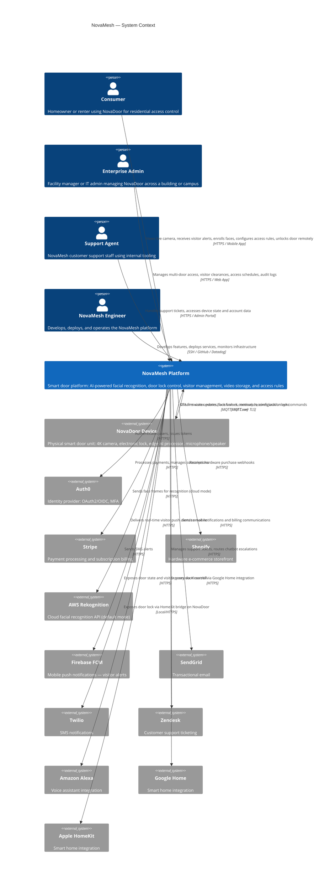

# System Context Diagram (C4 Level 1)

This diagram shows NovaMesh as a single system and its relationships with external users and third-party systems.

---

## Context Narrative

NovaMesh sits at the intersection of **physical hardware** and **cloud intelligence**. The NovaDoor device is the primary data source — it captures video frames, detects motion and persons, and executes lock/unlock commands. The cloud platform processes those frames (via AI), applies access rules, delivers notifications, and manages subscriptions and billing.

### Three User Types

| User | Interaction Pattern | Key Concern |
|---|---|---|
| **Consumer** | Mobile-first; real-time alerts for visitor events; periodic face enrollment and rule configuration | Speed of alert delivery; accuracy of recognition; privacy of face data |
| **Enterprise Admin** | Web dashboard; managing tens or hundreds of NovaDoor units across sites; compliance reporting | Multi-site management; audit trails; uptime SLAs; tenant isolation |
| **Support Agent** | Internal admin portal; reading device state and account data; resolving customer issues | Access to live device status; subscription state visibility |

### External Dependency Risk Summary

| System | Dependency Type | Risk Level | Notes |
|---|---|---|---|
| AWS Rekognition | Core product feature (face recognition, cloud mode) | **Very High** | NovaMesh's primary differentiator depends on this; no abstraction layer; biometric data leaves NovaMesh systems |
| Auth0 | Core authentication | High | All authenticated requests depend on this; outage = platform inaccessible |
| Stripe | Revenue-critical | High | Subscription renewals and billing flow through this |
| Firebase FCM | Visitor alert delivery | Medium | Delays or failures affect the primary consumer value proposition (knowing who's at the door) |
| NovaDoor Device | Physical hardware | High | Product doesn't function without working hardware; OTA failures have physical safety implications |
