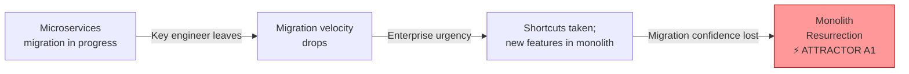
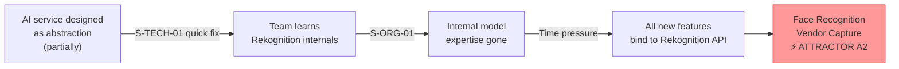
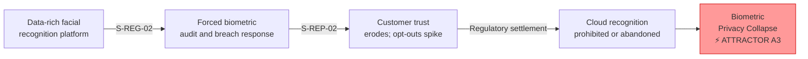
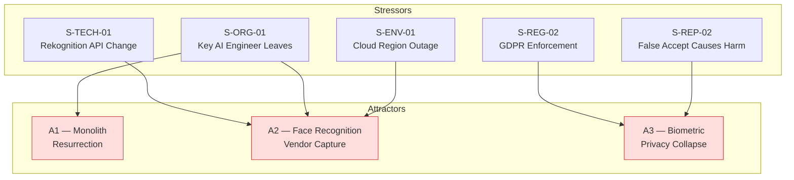

# Attractors Analysis

This document identifies and describes **attractor states** for the NovaMesh architecture — the stable configurations that the system gravitates toward when subject to stress. Understanding attractors is essential to Residuality Theory because it reveals *where the system is trying to go* rather than where architects planned for it to be.

> In complexity science, an **attractor** is a set of values toward which a system tends to evolve, regardless of its starting conditions. Complex systems don't explore all possible states — they cluster around a small number of attractors. Software architectures behave similarly under accumulated stress.

---

## How to Read This Document

Each attractor describes:
1. **The stable state**: What does the architecture look like if it settles here?
2. **How the system arrives there**: Which stressors push the system toward this attractor?
3. **Consequences**: What does this state mean for NovaMesh as a business and for users?
4. **Escape conditions**: What architectural residues would allow the system to escape or resist this attractor?

---

## Attractor A1 — Monolith Resurrection

### Stable State
The microservices migration stalls. The Legacy Monolith, rather than being decomposed, grows back — new features are added directly to it because it's faster, better understood, and has lower operational overhead than the fragmented in-flight microservices. The AI Platform's access rules and facial recognition capabilities are never fully extracted into independent services. Enterprise features pile into the monolith because the deadline pressure to land enterprise accounts is relentless.

### How the System Arrives Here

- The lead ML engineer resigns (S-ORG-01) → facial recognition pipeline development stalls → easier to build workarounds in the monolith
- Enterprise customer urgency (e.g., a large property management RFP) → 30-day deadline → new engineers default to the better-understood monolith
- The dual-write migration produces billing inconsistencies → confidence in the migration approach collapses → new leadership pauses migration

### Consequences
- **Positive**: Reduced operational complexity short-term; faster feature delivery for enterprise
- **Negative**: The biometric data governance problem becomes permanently harder to solve when face recognition logic lives inside a single application; the original reasons for migration (single point of failure, slow deployments, unsafe door lock logic mixed with subscription code) return with added severity

### Escape Conditions (Residues)
- A strict "no new features in monolith" constraint enforced via team agreements and CI/CD
- Anti-corruption layer between monolith and new services to prevent back-bleeding
- Migration progress made visible to leadership so it cannot be silently deprioritised

---

## Attractor A2 — Face Recognition Vendor Capture

### Stable State
NovaMesh's entire facial recognition capability becomes structurally dependent on AWS Rekognition. The internal MobileFaceNet model development is abandoned (especially likely after S-ORG-01). The Facial Recognition Service becomes a thin wrapper around Rekognition's specific API semantics — not a vendor-agnostic interface. Edge AI models on the NovaDoor are rarely updated because the cloud Rekognition model is "good enough." When AWS changes Rekognition pricing, deprecates APIs, or experiences outages, NovaMesh has no alternative. All biometric face data is processed and stored by AWS, creating a permanent third-party data processing relationship that cannot be unwound without rebuilding the entire recognition pipeline.

### How the System Arrives Here

- Rekognition API change (S-TECH-01) is fixed by patching call sites, not by building an abstraction → team learns Rekognition's API internals deeply
- Lead ML engineer leaves (S-ORG-01) → internal model expertise is gone
- Time pressure to add new AI features → team uses Rekognition because it's the fastest available path
- Cloud outage (S-ENV-01) → team adds better retry logic around Rekognition rather than investing in provider independence

### Consequences
- **Positive**: Fast iteration on recognition features; access to AWS's latest improvements; no ML infrastructure to maintain
- **Negative**: Pricing exposure; no negotiating leverage; biometric data processing by AWS creates GDPR data processor relationship complexity; any Rekognition outage disables the core product; edge model (privacy mode) cannot be improved without the internal model; BIPA risk if Rekognition's data handling doesn't meet state law requirements

### Escape Conditions (Residues)
- Vendor-agnostic recognition interface: all internal consumers talk to an abstraction that specifies *what* is needed (embedding, match result, confidence), not *how* Rekognition delivers it
- Investment in the internal MobileFaceNet model as the primary recognition path, with Rekognition as the fallback
- Regular "provider substitution drill" — test that the system can switch recognition backends without changing consumers

---

## Attractor A3 — Biometric Privacy Collapse

### Stable State
A combination of regulatory enforcement and customer trust erosion forces NovaMesh to drastically reduce biometric data collection. The facial recognition feature — the core product differentiator — is restricted to opt-in-only edge processing with no cloud component. Model quality stagnates because there is no cloud training data. Recognition accuracy drops below the threshold where auto-unlock can be safely offered (false accept rate rises above acceptable levels). The subscription tiers lose their primary differentiating feature. NovaMesh is legally constrained to a much simpler product — effectively a more expensive Ring Doorbell with fewer capabilities.

### How the System Arrives Here

- GDPR enforcement (S-REG-02) → biometric data audit reveals widespread non-compliance → forced data deletion → recognition quality degrades
- False accept incident causes physical harm (S-REP-02) → goes viral → customer backlash demands opt-out-by-default and data deletion
- Regulatory enforcement and reputational damage combine → legal settlement requires data minimisation → cloud recognition prohibited

### Consequences
- **Positive**: Regulatory clarity; potential trust recovery with privacy-first positioning; edge-only recognition is a genuine differentiator vs Ring/Google
- **Negative**: Recognition model quality degrades without cloud training data; auto-unlock feature becomes unreliable; subscription tier value proposition collapses; competitive disadvantage versus vendors who established compliant data practices earlier

### Escape Conditions (Residues)
- Privacy-by-design biometric architecture: consent management, data minimisation, and deletion as first-class architectural concerns from day one
- Edge-first architecture: recognition runs locally by default; cloud used only when explicitly opted in — turning the regulatory constraint into a product advantage
- Independent on-device model update path: face recognition model can be updated without a full firmware OTA, enabling fast response to accuracy or security issues

---

## Attractor Map

---

## Discussion Questions

1. Which attractor do you believe NovaMesh is currently drifting toward most strongly? What evidence from the architecture supports this?

2. Are there stressors that push toward *two attractors simultaneously*? For example: how does S-ORG-01 (key engineer leaves) interact with both A1 (Monolith Resurrection) and A2 (Vendor Capture)?

3. Could any of these attractors represent a *better* outcome than the current trajectory? For example: could Attractor A3 (Biometric Privacy Collapse) — forced edge-only recognition — actually become a competitive advantage if handled well?

4. Are there attractors the pre-built set doesn't capture? What would happen to NovaMesh if it grew 10x without changing its architecture? What if it was acquired by a private equity firm focused on cost extraction?
