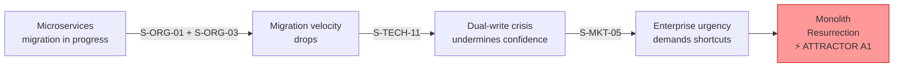
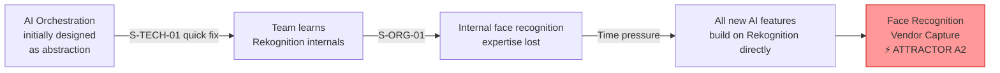
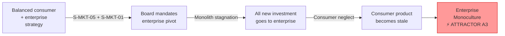
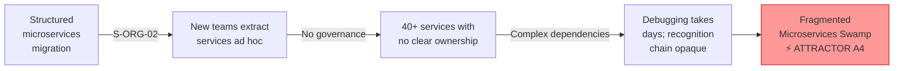
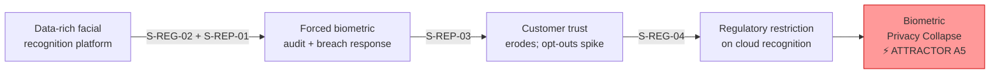

# Attractors Analysis

This document identifies and describes the **attractor states** for the NovaMesh architecture — the stable configurations that the system gravitates toward when subject to stress. Understanding attractors is essential to Residuality Theory because it reveals *where the system is trying to go* rather than where architects planned for it to be.

> In complexity science, an **attractor** is a set of values toward which a system tends to evolve, regardless of its starting conditions. Complex systems don't explore all possible states — they cluster around a small number of attractors. Software architectures behave similarly under accumulated stress.

---

## How to Read This Document

Each attractor describes:
1. **The stable state**: What does the architecture look like if it settles here?
2. **How the system arrives there**: Which stressors push the system toward this attractor?
3. **Consequences**: What does this state mean for NovaMesh as a business and for users?
4. **Escape conditions**: What architectural residues would allow the system to escape or resist this attractor?

---

## Attractor A1 — The Monolith Resurrection

### Stable State
The microservices migration stalls. The Legacy Monolith, rather than being decomposed, grows back — new enterprise features are added directly to it because it's faster, better understood, and has lower operational overhead than maintaining fragmented microservices. The new microservices that were extracted (Identity, Device Management) remain, but they become increasingly isolated islands. Enterprise access control features, visitor management, and compliance reporting are all built directly into the monolith. The AI Platform's access rules and visitor intelligence engines are never fully extracted.

### How the System Arrives Here

This attractor is triggered by a combination of organisational and technical stressors:

- **S-ORG-01** (key AI engineer resigns) → facial recognition pipeline development stalls → faster to add features to monolith
- **S-ORG-03** (CTO departure) → new leadership deprioritises migration, focuses on enterprise features
- **S-TECH-11** (dual-write divergence) → confidence in migration approach collapses
- **S-ORG-02** (rapid headcount growth) → new engineers default to the better-documented monolith
- **S-MKT-05** (property management consolidation) → urgent enterprise access control features needed in weeks, not months

### Consequences
- **Positive**: Reduced operational complexity in the short term; faster feature delivery for enterprise
- **Negative**: The AI Platform (facial recognition, access rules, visitor intelligence) becomes permanently coupled to the monolith; biometric data governance becomes impossible to implement consistently; the original reasons for migration (single point of failure, scaling constraints, slow CI/CD) return with the added dimension of safety-critical door lock logic in a monolith

### Escape Conditions (Residues)
- Automated migration progress metrics that make regression visible to leadership
- Clear technical mandate from leadership that cannot be overridden by short-term pressure
- Anti-corruption layer between monolith and new services to prevent back-bleeding
- "Strangler fig" pattern enforced: no new features in monolith, only in new services

---

## Attractor A2 — The Face Recognition Vendor Capture

### Stable State
NovaMesh's entire facial recognition capability becomes structurally dependent on a single external vendor (AWS Rekognition). The internal MobileFaceNet model development is abandoned; the AI Orchestration Service becomes a thin passthrough wrapper that only understands Rekognition's API semantics. Edge AI models on the NovaDoor are rarely updated because the cloud Rekognition model is "good enough." When AWS changes Rekognition pricing, deprecates APIs, or experiences outages, NovaMesh has no alternative. Critically, all biometric face data is processed and stored by AWS — creating a permanent third-party data processing relationship that cannot be unwound without rebuilding the entire recognition pipeline.

### How the System Arrives Here

- **S-TECH-01** (Rekognition API breaking change, addressed by patching not abstracting) → team learns Rekognition API internals deeply, dependency deepens
- **S-ORG-01** (ML engineer leaves) → internal MobileFaceNet model development expertise is lost
- **S-TECH-02** (Rekognition outage) → team builds better retry logic around Rekognition rather than building provider abstraction
- Time pressure from enterprise features → no time to build genuine abstraction layers
- **S-MKT-01** (Ring launches face recognition) → team rushes AI features using the fastest available tools (Rekognition)

### Consequences
- **Positive**: Fast iteration on recognition features; access to AWS's latest model improvements; no ML infrastructure maintenance burden
- **Negative**: Pricing exposure (AWS can raise Rekognition prices); no negotiating leverage; regulatory exposure (biometric face data processing by AWS creates GDPR data processor relationship complexity); product differentiation eroded if Ring/Google also use Rekognition; complete outage dependency; privacy-mode (edge recognition) capability cannot be improved without the internal model; BIPA class action risk if Rekognition's data handling doesn't meet state law requirements

### Escape Conditions (Residues)
- AI provider abstraction layer (model-agnostic recognition interface) implemented before adding the 3rd recognition feature
- Investment in internal MobileFaceNet model for the core recognition use case
- Regular "vendor substitution drill" — quarterly test that the system can switch recognition providers within 4 hours
- Edge model parity strategy: internal edge model should match cloud model accuracy within 2% tolerance

---

## Attractor A3 — The Enterprise Monoculture

### Stable State
Enterprise revenue becomes dominant, and all architectural decisions are made in service of enterprise requirements (building access control, visitor management, compliance). Consumer features stagnate. The product's AI capabilities — the facial recognition accuracy, visitor intelligence, and access rules flexibility — are not invested in for consumer use, because enterprise customers primarily want audit logs, RBAC, and SLA guarantees. The architecture becomes a B2B access control platform with a consumer product that hasn't been updated in 18 months and is losing ground to Ring and Google Nest.

### How the System Arrives Here

- **S-MKT-05** (enterprise consolidation, high-value RFP) → executive team commits engineering resources to enterprise features
- **S-MKT-01** (Ring launches face recognition, consumer churn accelerates) → enterprise grows relatively faster; board shifts focus
- Board pressure to improve average contract value → enterprise KPIs dominate roadmap
- Monolith (which still holds enterprise management) is not migrated → enterprise features remain legacy-bound and AI Platform is deprioritised
- Consumer face recognition accuracy stalls → consumer NPS drops → consumer churns → further board justification for enterprise focus

### Consequences
- **Positive**: Higher ACV, more predictable revenue, better unit economics
- **Negative**: Consumer base (which was the face recognition training data source) shrinks; recognition models lose signal quality; enterprise customers who bought based on AI capabilities experience feature regression; competitive moat disappears; hardware business suffers without consumer scale

### Escape Conditions (Residues)
- Platform architecture that separates enterprise management features from AI/consumer capabilities
- Product mandate that consumer AI features receive a minimum share of engineering investment
- Shared recognition model training that benefits from both consumer and enterprise data (aligned incentives)

---

## Attractor A4 — The Fragmented Microservices Swamp

### Stable State
The microservices migration succeeds in decomposing the monolith, but without proper governance. The system ends up with 40+ microservices, many owned by different sub-teams, with no consistent service mesh, inconsistent observability, multiple data stores with unclear ownership, and a complex dependency graph that nobody fully understands. The recognition pipeline — C9 → C11 → C3 — spans three teams with no agreed end-to-end SLO. Debugging a "door didn't unlock" incident requires correlating logs across 5 services. New access rule features require modifying 4 services simultaneously.

### How the System Arrives Here

- **S-ORG-02** (rapid headcount growth) → new teams extract services without architectural governance
- **S-ORG-01** (key engineer leaves) → AI Platform fragments into isolated components with no shared orchestration
- Migration pressure → services extracted without resolving data ownership (notification preferences scattered, face embeddings referenced from multiple services)
- No service mesh → inconsistent resilience patterns; recognition chain has no circuit breaking
- No feature flags → each service has its own rollout mechanism; recognition model updates and rule changes can't be coordinated

### Consequences
- **Positive**: Individual services can scale independently; blast radius per deployment is smaller
- **Negative**: Overall system reliability decreases; developer velocity collapses; on-call becomes untenable; the recognition pipeline end-to-end SLO (critical for the auto-unlock safety case) cannot be measured or guaranteed; biometric data governance becomes even harder when 10+ teams touch face data

### Escape Conditions (Residues)
- Service mesh (e.g., Istio) enforcing consistent mTLS, circuit breaking, and observability before reaching 15 services
- Recognition pipeline defined as a first-class architectural boundary with owned end-to-end SLO
- Platform team owning shared infrastructure (observability, secrets, service discovery, biometric data access) rather than each team building their own
- Domain-driven design boundaries enforced as Conway's Law — team topology matches bounded contexts

---

## Attractor A5 — The Biometric Privacy Collapse

### Stable State
A combination of regulatory enforcement and customer trust erosion results in NovaMesh being forced to drastically reduce biometric data collection. The facial recognition feature — the core product differentiator — is restricted to opt-in-only edge processing with no cloud component. Model quality stagnates because there is no training data. Recognition accuracy drops below the threshold where auto-unlock is safe to offer (false accept rate rises). The subscription tiers lose their primary differentiating feature. NovaMesh is legally constrained to a much simpler product with camera-only functionality — effectively becoming a more expensive Ring Doorbell with fewer capabilities.

### How the System Arrives Here

- **S-REG-02** (GDPR enforcement, biometric data) → forces data audit; reveals widespread biometric non-compliance
- **S-REP-03** (frame retention for training without consent goes viral) → customer backlash demands opt-out-by-default and data deletion
- **S-REP-01** (biometric data breach) → legal exposure forces data minimisation strategy as part of regulatory settlement
- **S-REG-04** (facial recognition prohibition in key markets) → forces edge-only mode across the customer base

### Consequences
- **Positive**: Regulatory clarity; potential trust recovery with privacy-first positioning; edge-only recognition is actually a genuine differentiator vs. Ring/Google
- **Negative**: Recognition model quality degrades without cloud training data; auto-unlock feature becomes unreliable; planned revenue streams blocked; competitive disadvantage versus vendors who established compliant data practices earlier; subscription tier value proposition collapses

### Escape Conditions (Residues)
- Privacy-by-design biometric architecture: consent management, data minimisation, and deletion as first-class architectural concerns — not afterthoughts
- Federated learning approach: recognition model improved from on-device training signals without centralising raw face frames
- Edge-first architecture: recognition runs locally by default; cloud used only when explicitly opted in — turning the regulatory constraint into a product advantage
- Explicit biometric data strategy that can withstand the strictest plausible regulatory interpretation from day one

---

## Attractor Map

The following diagram shows how stressors push the system toward attractors, and where attractor states overlap (a system can be partially in multiple attractors simultaneously).

```mermaid
graph TD
    subgraph Stressors
        S1["S-ORG-01<br/>Key AI Engineer Leaves"]
        S2["S-ORG-03<br/>CTO Departure"]
        S3["S-TECH-11<br/>Dual-write Divergence"]
        S4["S-MKT-05<br/>Property Mgmt Consolidation"]
        S5["S-TECH-01<br/>Rekognition API Change"]
        S6["S-ORG-02<br/>Rapid Headcount Growth"]
        S7["S-REG-02<br/>GDPR Enforcement"]
        S8["S-REP-01<br/>Biometric Data Breach"]
        S9["S-MKT-01<br/>Ring Launches Face Recognition"]
        S10["S-REP-03<br/>Unauthorised Surveillance"]
        S11["S-REG-04<br/>Facial Recognition Prohibition"]
    end

    subgraph Attractors
        A1["A1 — Monolith\nResurrection"]
        A2["A2 — Face Recognition\nVendor Capture"]
        A3["A3 — Enterprise\nMonoculture"]
        A4["A4 — Fragmented\nMicroservices Swamp"]
        A5["A5 — Biometric\nPrivacy Collapse"]
    end

    S1 --> A1
    S1 --> A2
    S2 --> A1
    S2 --> A3
    S2 --> A2
    S3 --> A1
    S4 --> A3
    S5 --> A2
    S6 --> A4
    S6 --> A1
    S7 --> A5
    S8 --> A5
    S9 --> A2
    S9 --> A3
    S10 --> A5
    S11 --> A5

    style A1 fill:#ffdddd,stroke:#cc4444
    style A2 fill:#ffdddd,stroke:#cc4444
    style A3 fill:#ffdddd,stroke:#cc4444
    style A4 fill:#ffdddd,stroke:#cc4444
    style A5 fill:#ffdddd,stroke:#cc4444
```

---

## Workshop Discussion Questions

1. Which attractor do you believe the NovaMesh architecture is *currently* most gravitating toward? What evidence from the current architecture supports this?

2. Are there stressors in the catalogue that could push NovaMesh toward *two attractors simultaneously*? (e.g., S-REP-01 (biometric breach) could simultaneously push toward A5 (Privacy Collapse) and A2 (Vendor Capture, as NovaMesh outsources recognition to avoid holding data). What would that look like in practice?)

3. For Attractor A5 (Biometric Privacy Collapse): unlike the original "Privacy Collapse" for a generic AI platform, this attractor has a physical safety dimension — if recognition accuracy drops, auto-unlock cannot be offered safely. How does the physical safety requirement change the design of residues to escape this attractor?

4. Are there attractors you would add that aren't listed here? (For example: "The Safety Incident Freeze" — a false-accept incident causes NovaMesh to disable auto-unlock company-wide, eliminating the feature that justifies the subscription price)

5. The escape conditions listed for each attractor describe architectural residues. Which of these residues would be the most valuable to design *now*, given the current state of the NovaMesh architecture? Consider that A2 (Vendor Capture) and A5 (Privacy Collapse) are in tension — the more you rely on edge-only recognition to escape A5, the more you need to invest in internal models to escape A2.
