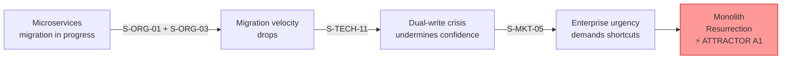
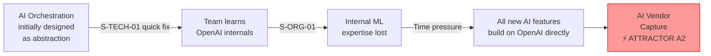
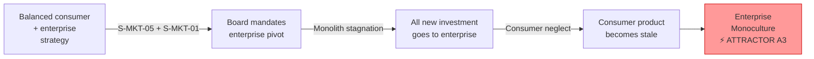
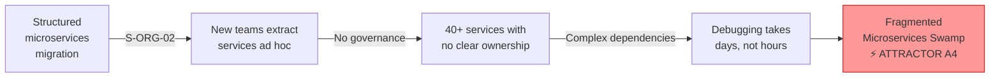
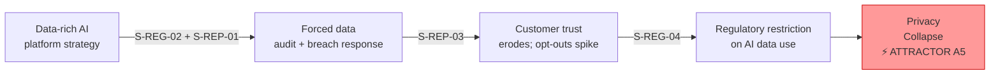
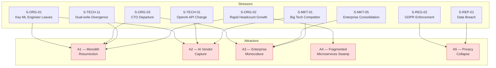

# Attractors Analysis

This document identifies and describes the **attractor states** for the NovaMesh architecture — the stable configurations that the system gravitates toward when subject to stress. Understanding attractors is essential to Residuality Theory because it reveals *where the system is trying to go* rather than where architects planned for it to be.

> In complexity science, an **attractor** is a set of values toward which a system tends to evolve, regardless of its starting conditions. Complex systems don't explore all possible states — they cluster around a small number of attractors. Software architectures behave similarly under accumulated stress.

---

## How to Read This Document

Each attractor describes:
1. **The stable state**: What does the architecture look like if it settles here?
2. **How the system arrives there**: Which stressors push the system toward this attractor?
3. **Consequences**: What does this state mean for NovaMesh as a business and for users?
4. **Escape conditions**: What architectural residues would allow the system to escape or resist this attractor?

---

## Attractor A1 — The Monolith Resurrection

### Stable State
The microservices migration stalls. The Legacy Monolith, rather than being decomposed, grows back — new features are added directly to it because it's faster, better understood, and has lower operational overhead than maintaining fragmented microservices. The new microservices that were extracted (Identity, Device Management) remain, but they become increasingly isolated islands. Enterprise features, the AI Platform integration, and all new B2B capabilities are built directly into the monolith.

### How the System Arrives Here

This attractor is triggered by a combination of organisational and technical stressors:

- **S-ORG-01** (key AI engineer resigns) → AI Platform velocity drops → faster to add features to monolith
- **S-ORG-03** (CTO departure) → new leadership deprioritises migration
- **S-TECH-11** (dual-write divergence) → confidence in migration approach collapses
- **S-ORG-02** (rapid headcount growth) → new engineers default to the better-documented monolith
- **S-MKT-05** (enterprise customer consolidation) → urgent enterprise features needed in weeks, not months

### Consequences
- **Positive**: Reduced operational complexity in the short term; faster feature delivery for enterprise
- **Negative**: Scalability ceiling reasserts itself; AI Platform remains disconnected; technical debt compounds; the original reasons for migration (single point of failure, scaling constraints, slow CI/CD) return

### Escape Conditions (Residues)
- Automated migration progress metrics that make regression visible to leadership
- Clear technical mandate from leadership that cannot be overridden by short-term pressure
- Anti-corruption layer between monolith and new services to prevent back-bleeding
- "Strangler fig" pattern enforced: no new features in monolith, only in new services

---

## Attractor A2 — The AI Vendor Capture

### Stable State
NovaMesh's entire AI strategy becomes structurally dependent on a single AI vendor (OpenAI). The AI Orchestration Service, initially intended as an abstraction layer, becomes a thin passthrough wrapper that only understands OpenAI's API semantics. Internal models are abandoned because OpenAI's hosted models are easier to use and iterate with. Edge AI models on the Hub are rarely updated because the cloud AI is "good enough." When OpenAI changes pricing, deprecates models, or experiences outages, NovaMesh has no alternative.

### How the System Arrives Here

- **S-TECH-01** (OpenAI API breaking change, addressed by patching not abstracting) → team learns OpenAI API internals deeply, dependency deepens
- **S-ORG-01** (ML engineer leaves) → internal model development expertise is lost
- **S-TECH-02** (OpenAI outage) → team builds better retry logic around OpenAI rather than building provider abstraction
- Time pressure from enterprise features → no time to build genuine abstraction layers
- **S-MKT-01** (Big Tech competitor) → team rushes AI features using the fastest available tools (OpenAI)

### Consequences
- **Positive**: Fast iteration on AI features; access to latest models immediately
- **Negative**: Pricing exposure (OpenAI has raised prices historically); no negotiating leverage; regulatory risk if OpenAI data processing terms conflict with GDPR; product differentiation is eroded (if OpenAI builds competing features); complete outage dependency

### Escape Conditions (Residues)
- AI provider abstraction layer (model-agnostic interface) implemented before adding the 3rd AI feature
- Investment in at least one internal model for a core use case (anomaly detection is a natural candidate)
- Regular "vendor substitution drill" — quarterly test that the system can switch AI providers within 4 hours

---

## Attractor A3 — The Enterprise Monoculture

### Stable State
Enterprise revenue becomes dominant, and all architectural decisions are made in service of enterprise requirements. Consumer features stagnate. The product's consumer AI capabilities — which are the foundation of enterprise appeal — are not invested in because enterprise customers primarily want fleet management, compliance, and SLAs. The architecture becomes a B2B platform with a consumer product that hasn't been updated in 18 months.

### How the System Arrives Here

- **S-MKT-05** (enterprise consolidation, high-value RFP) → executive team commits engineering resources to enterprise features
- **S-MKT-01** (Big Tech competitor in consumer space) → consumer ARR growth slows, enterprise grows relatively faster
- Board pressure to improve average contract value → enterprise KPIs dominate roadmap
- Monolith (which still holds enterprise management) is not migrated → enterprise features remain legacy-bound

### Consequences
- **Positive**: Higher ACV, more predictable revenue, better unit economics
- **Negative**: Consumer base (which was the AI training data source) shrinks; AI models lose signal quality; enterprise customers who bought based on AI capabilities experience feature regression; competitive moat disappears

### Escape Conditions (Residues)
- Platform architecture that separates enterprise management features from AI/consumer capabilities
- Product mandate that consumer AI features receive a minimum share of engineering investment
- Enterprise data usage feeding back into consumer AI improvements (shared training loop)

---

## Attractor A4 — The Fragmented Microservices Swamp

### Stable State
The microservices migration succeeds in decomposing the monolith, but without proper governance. The system ends up with 40+ microservices, many owned by different sub-teams, with no consistent service mesh, inconsistent observability, multiple data stores with no clear ownership, and a complex dependency graph that nobody fully understands. Deployments require coordination across 8 teams. Debugging production issues takes days. New features require modifications to 5+ services.

### How the System Arrives Here

- **S-ORG-02** (rapid headcount growth) → new teams extract services without architectural governance
- **S-ORG-01** (key engineer leaves) → AI Platform fragments into isolated components with no orchestration
- Migration pressure → services extracted without resolving data ownership (e.g., notification preferences scattered across 3 databases)
- No service mesh → inconsistent resilience patterns across services
- No feature flags → each service has its own rollout mechanism

### Consequences
- **Positive**: Individual services can scale independently; blast radius per deployment is smaller
- **Negative**: Overall system reliability decreases; developer velocity collapses; on-call becomes untenable; the benefits of microservices are lost in coordination overhead

### Escape Conditions (Residues)
- Service mesh (e.g., Istio) enforcing consistent mTLS, circuit breaking, and observability before reaching 15 services
- Architectural fitness functions that alert when dependency complexity exceeds thresholds
- Platform team owning shared infrastructure (observability, secrets, service discovery) rather than each team building their own
- Domain-driven design boundaries enforced as Conway's Law — team topology matches bounded contexts

---

## Attractor A5 — The Privacy Collapse

### Stable State
A combination of regulatory enforcement and customer trust erosion results in NovaMesh being forced to drastically reduce data collection. AI features that depend on rich telemetry data lose accuracy. The personalisation engine and energy optimisation features — which require household behaviour data — cannot be built. The company is legally constrained to a much simpler product with less AI capability than originally planned.

### How the System Arrives Here

- **S-REG-02** (GDPR enforcement) → forces data audit; reveals widespread non-compliance
- **S-REP-03** (AI Assistant privacy violation goes viral) → customer backlash demands opt-out-by-default
- **S-REG-04** (children's privacy expansion) → retroactively requires deletion of vast amounts of household data
- **S-REP-01** (data breach) → legal exposure forces data minimisation strategy as part of settlement

### Consequences
- **Positive**: Regulatory clarity; potential trust recovery with privacy-first positioning
- **Negative**: AI model quality degrades without training data; planned revenue streams blocked; competitive disadvantage versus vendors who established compliant data practices earlier

### Escape Conditions (Residues)
- Privacy-by-design architecture: consent management, data minimisation, and deletion as first-class architectural concerns — not afterthoughts
- Federated learning approach: models trained on-device without centralising raw data
- Data governance layer as a prerequisite for any new AI feature, not a post-hoc compliance exercise
- Explicit data strategy that can withstand the strictest plausible regulatory interpretation

---

## Attractor Map

The following diagram shows how stressors push the system toward attractors, and where attractor states overlap (a system can be partially in multiple attractors simultaneously).

---

## Workshop Discussion Questions

1. Which attractor do you believe the NovaMesh architecture is *currently* most gravitating toward? What evidence from the current architecture supports this?

2. Are there stressors in the catalogue that could push NovaMesh toward *two attractors simultaneously*? What would that look like in practice?

3. Are there attractors you would add that aren't listed here? (For example: "The Hardware Company That Forgot It's a Software Company" — abandoning the SaaS model entirely)

4. For Attractor A1 (Monolith Resurrection): is this necessarily bad? Under what circumstances might it be the *right* stable state for a company like NovaMesh?

5. The escape conditions listed for each attractor describe architectural residues. Which of these residues would be the most valuable to design *now*, given the current state of the NovaMesh architecture?
